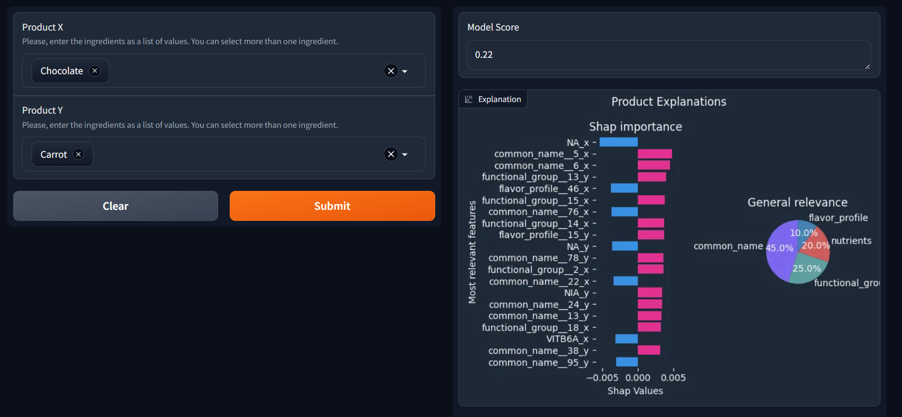
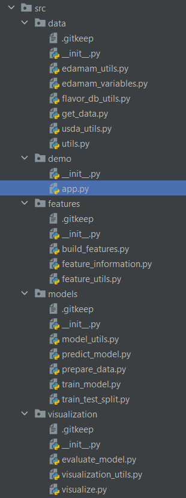
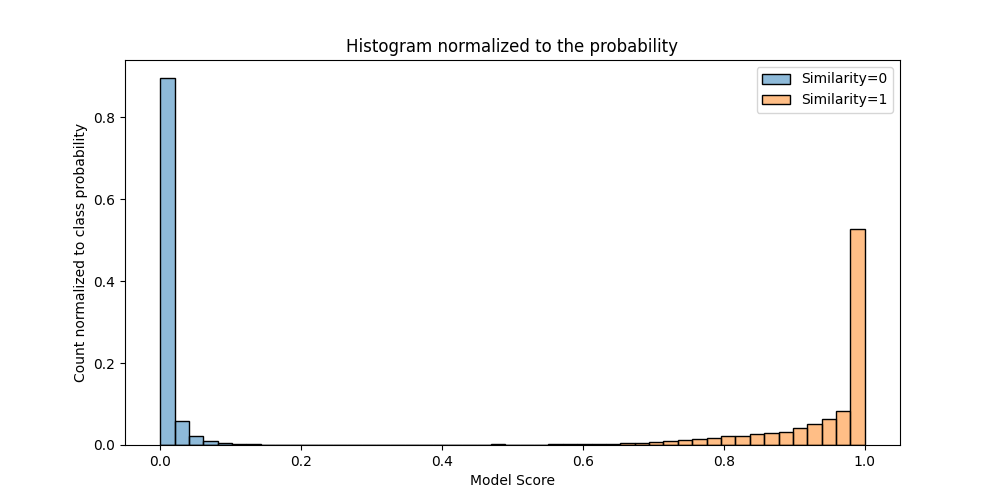
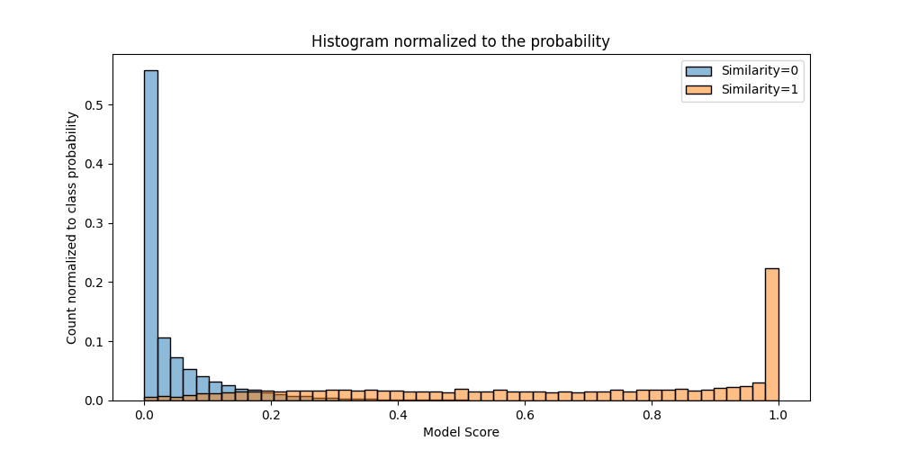
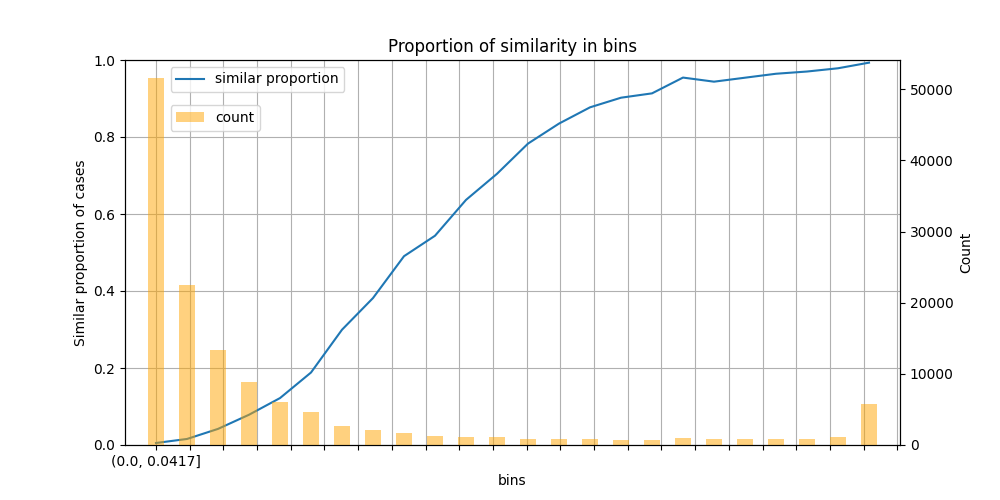

# Desarrollo de nuevos productos alimenticios funcionales con ingredientes endémicos de México, utilizando inteligencia artificial (IA)

Este es el repositorio designado para el proyecto de investigación.

Favor de abrir la carpeta `ai_in_food` para ver el contenido. 

¿Qué encontrarás?
----------------

1. Una demo del modelo siendo utilizado para realizar comparaciones del modelo.

2. El código correspondiente para la creación del modelo.

3. Algunos resultados que se han obtenido a lo largo del proyecto. 

3.1 Distribución del score en el entrenamiento:

3.2 Distribución del score en la evaluación

3.3 Proporción de similitud entre productos por bins de score. 

